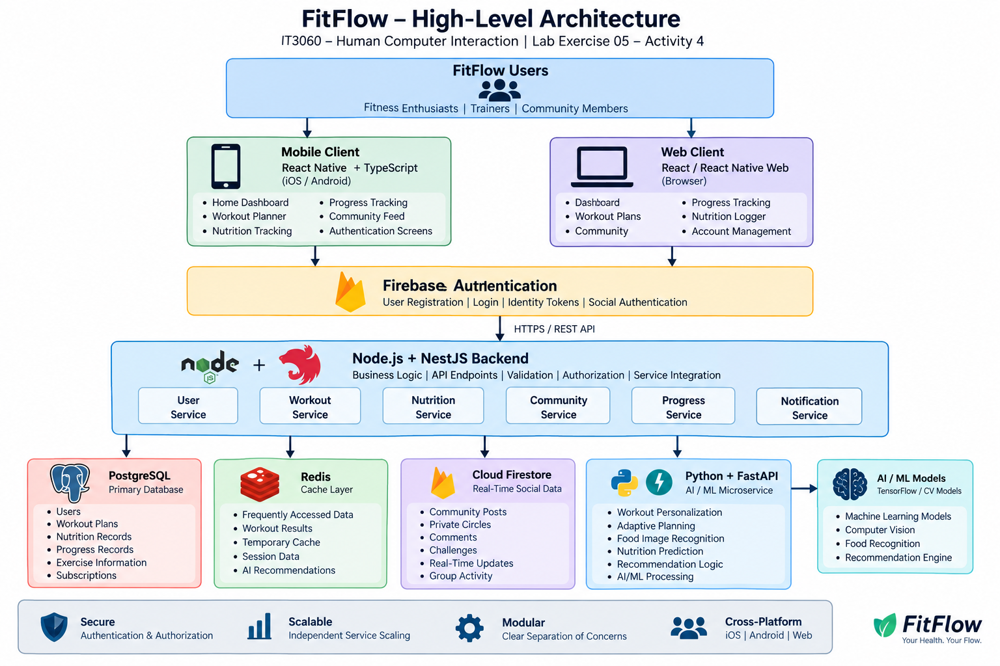

# FitFlow High-Level Architecture

## IT3060 – Human Computer Interaction
### Lab Exercise 05 – Activity 4

---

## 1. Architecture Overview

The proposed FitFlow architecture follows a modular and service-oriented approach. The system separates the frontend, main backend, AI/ML processing, structured data storage, real-time social data, authentication, and caching into clearly defined components.

The architecture is designed to support the major FitFlow requirements, including:

- AI-powered personalized workout plans
- Adaptive workout rescheduling
- Camera-based nutrition tracking
- Private social fitness circles
- Progress tracking
- Real-time community updates
- Secure user authentication
- Cross-platform access

The selected technology stack is:

- **Mobile Frontend:** React Native + TypeScript
- **Web Frontend:** React / React Native Web
- **Main Backend:** Node.js + NestJS
- **AI Microservice:** Python + FastAPI
- **Primary Database:** PostgreSQL
- **Real-Time Layer:** Cloud Firestore
- **Authentication:** Firebase Authentication
- **Caching:** Redis

This architecture allows the major services to be developed, maintained, and scaled independently while keeping the overall application integrated through the NestJS backend.

---

## 2. Selected Technology Stack

| System Layer | Technology | Purpose |
|---|---|---|
| Mobile Frontend | React Native + TypeScript | Cross-platform iOS and Android application |
| Web Frontend | React / React Native Web | Browser-based FitFlow access |
| Main Backend | Node.js + NestJS | Business logic and API services |
| AI Service | Python + FastAPI | AI/ML processing and recommendations |
| Primary Database | PostgreSQL | Structured and relational application data |
| Real-Time Layer | Cloud Firestore | Community and real-time social updates |
| Authentication | Firebase Authentication | User identity and login management |
| Cache Layer | Redis | Performance improvement and temporary caching |

---

## 3. High-Level Architecture

```text
                         +----------------------+
                         |     FitFlow User     |
                         +----------+-----------+
                                    |
                   +----------------+----------------+
                   |                                 |
                   v                                 v
        +-------------------------+       +-------------------------+
        | React Native +          |       | React / React Native    |
        | TypeScript              |       | Web                     |
        | iOS / Android Client    |       | Web Client              |
        +------------+------------+       +------------+------------+
                     |                                 |
                     +---------------+-----------------+
                                     |
                                     v
                         +-------------------------+
                         | Firebase Authentication |
                         | Identity / Tokens       |
                         +------------+------------+
                                      |
                                      v
                              HTTPS / REST API
                                      |
                                      v
                    +-----------------------------------+
                    |      Node.js + NestJS Backend     |
                    |                                   |
                    | - User Service                    |
                    | - Workout Service                 |
                    | - Nutrition Service               |
                    | - Community Service               |
                    | - Progress Service                |
                    | - Notification Service            |
                    +----+---------+---------+----------+
                         |         |         |        |
              +----------+         |         |        +-----------+
              |                    |         |                    |
              v                    v         v                    v
      +---------------+    +-------------+  +----------------+  +------------------+
      |  PostgreSQL   |    |    Redis    |  |   Firestore    |  | Python + FastAPI |
      | Primary Data  |    | Cache Layer |  | Real-Time Data |  | AI Microservice  |
      +---------------+    +-------------+  +----------------+  +--------+---------+
                                                                        |
                                                                        v
                                                               +------------------+
                                                               |  AI / ML Models  |
                                                               | TensorFlow / CV  |
                                                               +------------------+
```

The NestJS backend acts as the central integration layer between the frontend, databases, authentication service, caching layer, real-time services, and AI microservice.

---

## 4. Main Architecture Components

### 4.1 Frontend

The FitFlow frontend provides access through mobile and web platforms.

The mobile application is implemented using React Native and TypeScript for iOS and Android. Web access can be supported using React or React Native Web.

The frontend provides the major FitFlow interfaces:

- Home Dashboard
- AI Workout Planner
- Progress Tracking
- Community Feed
- Nutrition Logger
- Authentication screens

The frontend is responsible for:

- Displaying personalized workout recommendations
- Allowing users to view and update workout plans
- Capturing food images for nutrition logging
- Displaying progress information
- Providing access to private fitness communities
- Sending authenticated requests to the backend
- Displaying real-time social updates

The frontend communicates with the NestJS backend through secure HTTPS API requests.

---

### 4.2 Backend

The main backend is implemented using Node.js and NestJS.

NestJS manages:

- Business logic
- API endpoints
- Input validation
- Authentication token validation
- Authorization
- Database communication
- AI service communication
- Error handling
- Logging

The backend is divided into the following services.

#### User Service

Responsible for:

- User profiles
- Fitness preferences
- Fitness level information
- Account settings

#### Workout Service

Responsible for:

- Workout plans
- Workout sessions
- Exercise information
- Adaptive workout rescheduling
- AI-generated workout recommendations

#### Nutrition Service

Responsible for:

- Nutrition logs
- Meal information
- Food recognition results
- User corrections to AI predictions

#### Community Service

Responsible for:

- Private social circles
- Community posts
- Comments
- Group challenges
- Membership authorization

#### Progress Service

Responsible for:

- Workout history
- Progress statistics
- Weekly progress summaries
- Achievement badges

#### Notification Service

Responsible for:

- Workout reminders
- Community notifications
- Progress notifications
- Challenge notifications

---

## 5. AI / ML Microservice

The AI microservice is implemented using Python and FastAPI.

The AI service is separated from the main backend so that AI workloads can be developed, deployed, and scaled independently.

The AI microservice supports:

- Personalized workout recommendations
- Adaptive workout planning
- Recommendation reasoning
- Food image recognition
- Nutrition prediction
- Computer vision processing

The NestJS backend communicates with the FastAPI service through secure internal API requests.

The AI service does not directly manage user permissions or application business rules. The NestJS backend remains responsible for validation, authorization, and final data storage.

---

## 6. Data Storage and Real-Time Services

### 6.1 PostgreSQL

PostgreSQL is used as the primary relational database.

It stores structured FitFlow data such as:

- User profiles
- Workout plans
- Workout sessions
- Exercise information
- Nutrition records
- Progress records
- Subscription information

PostgreSQL is suitable for this information because the data contains clear relationships and requires strong consistency.

---

### 6.2 Cloud Firestore

Cloud Firestore is used for real-time social and community functionality.

It supports:

- Community posts
- Private fitness circles
- Comments
- Challenges
- Group activity
- Real-time social updates

Firestore allows social information to update quickly without placing all real-time workload on the primary PostgreSQL database.

---

### 6.3 Redis

Redis is used as the caching layer.

It can store temporary or frequently requested information such as:

- Current workout recommendations
- Frequently requested dashboard information
- Temporary application data
- Short-lived AI recommendation results

Example cache flow:

```text
User Request
     |
     v
NestJS Backend
     |
     v
 Check Redis
     |
 +---+---+
 |       |
Found  Not Found
 |       |
 v       v
Return  Query Database
Data    or AI Service
         |
         v
     Store in Redis
         |
         v
     Return Result
```

Redis reduces repeated database queries and improves response time.

---

## 7. Authentication and Authorization

Firebase Authentication is used to manage user identity.

It handles:

- User registration
- User login
- Authentication tokens
- Social authentication
- User identity management

Authentication determines:

**Who is the user?**

Authorization is managed by the NestJS backend.

Authorization determines:

**What is the user allowed to access?**

Possible roles include:

```text
USER
TRAINER
MODERATOR
ADMIN
```

Firebase-issued identity tokens are validated by the backend before protected requests are processed.

For example, a user must be authenticated and be an approved member before accessing a private fitness circle.

---

## 8. Critical Data Flow – Personalized Workout Plan

```text
User
 |
 v
React Native / Web Client
 |
 v
Firebase Authentication
 |
 v
NestJS Backend
 |
 v
Retrieve User Profile,
Schedule and Progress
from PostgreSQL
 |
 v
FastAPI AI Service
 |
 v
Generate Personalized Workout
 |
 v
Return Recommendation to NestJS
 |
 v
Validate Recommendation
 |
 v
Save Workout Plan in PostgreSQL
 |
 v
Return Workout Plan to Client
 |
 v
Display Personalized Workout
```

The AI service generates the personalized workout recommendation, while the NestJS backend remains responsible for application rules, authorization, validation, and permanent data storage.

---

## 9. Critical Data Flow – Nutrition Tracking

```text
User Takes Food Photo
        |
        v
React Native App
        |
        v
Firebase Authentication
        |
        v
NestJS Backend
        |
        v
FastAPI AI Service
        |
        v
Computer Vision /
Food Recognition Model
        |
        v
Nutrition Prediction
        |
        v
Return Prediction to User
        |
        v
User Confirms or Corrects
        |
        v
NestJS Backend
        |
        v
PostgreSQL
```

The user can confirm or correct the AI-generated nutrition prediction before the final nutrition record is stored.

This prevents incorrect AI predictions from automatically becoming permanent nutrition records.

---

## 10. Critical Data Flow – Social Community

```text
User Creates Post / Challenge
        |
        v
React Native / Web Client
        |
        v
Firebase Authentication
        |
        v
NestJS Backend
        |
        v
Authorization Check
        |
        v
Cloud Firestore
        |
        v
Real-Time Update
        |
        v
Approved Group Members
```

The NestJS backend checks whether the user has permission to access or modify the selected private fitness circle before completing the request.

---

## 11. Security Considerations

The proposed architecture includes the following security measures:

- HTTPS/TLS for secure communication
- Firebase Authentication for user identity
- Firebase token validation by the backend
- NestJS Guards for protected endpoints
- Role-based access control
- Encryption of sensitive information during transmission and storage
- Least-privilege access between services
- Restricted access to private social circles
- Secure storage of API keys and environment variables
- Audit logging for important security-related actions
- User consent management
- Account deletion support
- Data deletion support
- Privacy controls for fitness information

Sensitive credentials such as database passwords, API keys, and Firebase service credentials must not be stored directly in the source code repository.

---

## 12. Scalability Considerations

The architecture allows major FitFlow components to scale independently.

### 12.1 Backend Scaling

Multiple NestJS backend instances can be deployed behind a load balancer when user traffic increases.

```text
                 Load Balancer
                      |
        +-------------+-------------+
        |             |             |
        v             v             v
    NestJS #1     NestJS #2     NestJS #3
```

This distributes incoming requests across multiple backend instances.

---

### 12.2 AI Service Scaling

The FastAPI AI microservice can be scaled independently.

If the number of AI requests increases, additional AI service instances can be deployed without scaling every other application component.

---

### 12.3 PostgreSQL Scaling

PostgreSQL performance can be improved using:

- Database indexing
- Connection pooling
- Query optimization
- Read replicas where required

---

### 12.4 Firestore Scaling

Cloud Firestore manages real-time social activity separately from the primary relational database.

This prevents frequent community updates from creating unnecessary load on PostgreSQL.

---

### 12.5 Redis Caching

Redis reduces repeated database and AI requests by serving frequently requested or temporary information from memory.

---

## 13. Integration Considerations

The NestJS backend acts as the central integration point for the FitFlow system.

```text
                       NestJS Backend
                    /       |       |       \
                   /        |       |        \
                  v         v       v         v
           PostgreSQL    Redis   Firestore   FastAPI
                                               |
                                               v
                                             AI/ML
```

The backend provides a central location for:

- Business logic
- Input validation
- Authentication token validation
- Authorization
- API management
- Error handling
- Logging
- Database access
- AI service integration

This approach improves maintainability and prevents application logic from being distributed across multiple frontend components.

---

## 14. Architecture Benefits

The proposed architecture provides the following benefits.

### Cross-Platform Support

React Native supports shared mobile development for iOS and Android, while React or React Native Web can support browser-based access.

### Clear Separation of Responsibilities

Frontend, backend, AI processing, databases, authentication, and caching have clearly defined responsibilities.

### AI Integration

FastAPI provides a dedicated environment for AI and machine learning functionality.

### Real-Time Capability

Cloud Firestore supports community features that require real-time updates.

### Structured Data Management

PostgreSQL manages relational user, workout, nutrition, and progress information.

### Performance

Redis reduces repeated database operations and improves response speed.

### Security

Firebase Authentication and NestJS authorization provide identity management and controlled access to protected resources.

### Maintainability

The modular architecture allows individual components to be updated without redesigning the entire system.

### Scalability

The backend, AI service, database, real-time layer, and cache can be scaled according to workload.

---

## 15. Final Architecture Summary

```text
                 React Native / Web Client
                           |
                           v
                Firebase Authentication
                           |
                           v
                  HTTPS / REST API
                           |
                           v
               Node.js + NestJS Backend
                 /      |      |      \
                /       |      |       \
               v        v      v        v
        PostgreSQL    Redis  Firestore  FastAPI
                                         |
                                         v
                                      AI / ML
```

The proposed architecture supports:

- Cross-platform mobile and web access
- AI-powered workout personalization
- Adaptive workout rescheduling
- Camera-based nutrition tracking
- Real-time private social features
- Structured fitness data management
- Secure authentication and authorization
- Performance optimization
- Independent service scalability
- Long-term maintainability

This architecture provides a suitable technical foundation for the FitFlow redesign and supports the functional and non-functional requirements identified during the earlier research, analysis, interface design, and usability testing activities.

---

## 16. Architecture Diagram

A visual version of the architecture is stored in:

`docs/architecture-diagram.png`



The architectural decision and rationale are documented separately in:

`docs/ADR-001.md`